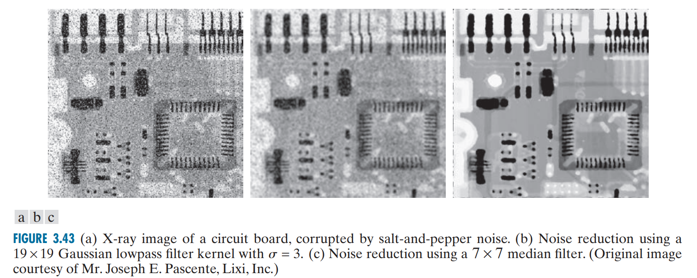

hình ảnh được làm mịn bằng bộ lọc phi tuyến tức là thay thế pixel ở trung tâm bộ lọc bằng một pixel có thứ tự nhất định trong số các pixel của ảnh bị phủ bởi bộ lọc. 

**Median filter**
- bộ lọc phi tuyến nổi tiếng nhất là **bộ lọc trung vị** (median filter) : vị - vị trí, trung - ở giữa -> sắp xếp hết tất cả các pixel bị phủ bởi bộ lọc theo chiều tăng/giảm dần -> thay thế pixel trung tâm bằng pixel đứng giữa (vd như với bộ lọc 3x3 thì sau khi sắp xếp sẽ lấy phần tử thứ 5).
- đặc biết tốt trong việc giảm một số loại nhiễu ví dụ như _impulse noise_ (hay còn gọi là _nhiễu muối tiêu_ - _salt-and-pepper noise_), mà lại ít làm mờ ảnh hơn bộ lọc tuyến tính có cùng kích cỡ

**Max filter**
- lấy thằng hàng xóm to nhất để thay thằng trung tâm$$\begin{aligned}\widehat{f}\left( x,y\right) =\max_{\left( r,c\right) \in S_{xy}} \left\{ g\left( r,c\right) \right\} \end{aligned}$$
	trong đó:
	- $S_{xy}$ là tập hợp các toạ độ của ảnh bị phủ bởi bộ lọc  
	- mn là số pixel của tập $S_(xy)$ vì của sổ lọc là một hình chữ nhật có kích thước mxn, tâm tại điểm (x, y)
	- $g(x, y)$ là ảnh ban đầu chưa được phục hồi (corrupted image)

- bộ lọc max hữu ích cho việc tìm ra điểm sáng nhất trong ảnh, hoặc là xoá những vùng tối ở cạnh vùng sáng

**Min filter**
$$\begin{aligned}\widehat{f}\left( x,y\right) =\min_{\left( r,c\right) \in S_{xy}} \left\{ g\left( r,c\right) \right\} \end{aligned}$$
